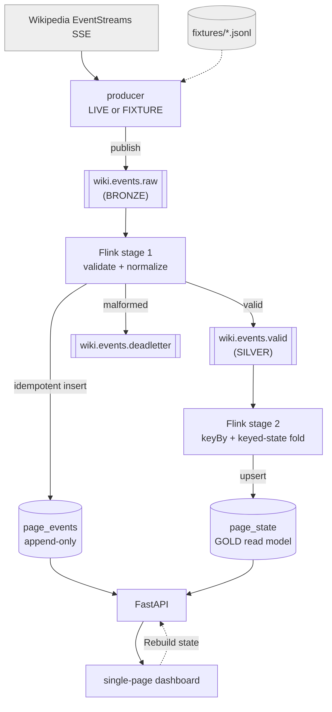

# PageLedger

**A live dashboard of English Wikipedia activity, where the current state of every page is a deterministic fold over an immutable event log — not a database being mutated in place.**

PageLedger is a Kafka + Flink event-sourcing pipeline. Every Wikipedia edit is an immutable event; a page's current stats (edit count, net byte delta, unique editors, last editor) are *derived* by folding over those events with Flink keyed state. The proof is a one-click **"Rebuild state"** that cancels the fold job, replays the entire event log from the beginning, and reconstructs the read model — landing byte-identical to where it started.

The mental model is a bank ledger: your balance isn't stored, it's the sum of every transaction. PageLedger applies that to Wikipedia pages.

---

## Architecture



| Layer | Store | What it is |
|---|---|---|
| **Bronze** | Kafka `wiki.events.raw` | Immutable log of every filtered event (en.wikipedia, non-bot, new/edit) |
| **Silver** | Kafka `wiki.events.valid` + Postgres `page_events` | Validated & normalized events; malformed ones diverted to a dead-letter topic |
| **Gold** | Postgres `page_state` | Folded projection — one row per page, the query-ready read model |

**Stage 1** (`flink-job/stage1_validate.py`) validates/normalizes bronze → silver and mirrors valid events into `page_events` (idempotent on `(wiki, revision_id)`). **Stage 2** (`flink-job/stage2_fold.py`) keys by `(wiki, page_title)` and folds each event into a `PageAggregate` held in Flink keyed state, upserting `page_state`. The fold is **order-independent and idempotent per revision** — which is what makes replay provably deterministic.

---

## Tech stack

PyFlink **1.20.5** (LTS) · Apache Kafka **4.2.1** (KRaft, official `apache/kafka` image) · PostgreSQL **17.10** · FastAPI **0.136.1** + vanilla JS (no build step) · `confluent-kafka` producer · pytest · Terraform + a single EC2 instance. Python **3.12** across the stack, except the Flink image (**3.11** — see [Engineering notes](#engineering-notes)).

Everything runs as one Docker Compose stack, identical on a laptop and on EC2.

---

## Run it locally

Only Docker is required.

```bash
git clone https://github.com/danielbasso/pageledger.git
cd pageledger
cp .env.example .env          # defaults are fine for local FIXTURE mode
docker compose up -d --build  # brings up the whole stack in MODE=FIXTURE
```

Open **http://localhost:8000**. The producer replays a recorded ~28-minute sample of real Wikipedia events (`producer/fixtures/wiki_events_sample.jsonl`) through the full pipeline, so the dashboard populates within a few seconds. Click a leaderboard row to see a page's event history resolve to its current state; click **Rebuild state** to watch the read model reconstruct from the log.

### Tests

The suite runs on the host against the running stack:

```bash
python -m venv .venv && . .venv/bin/activate
pip install -r tests/requirements.txt
pytest tests/ -v
```

- `test_malformed_event_goes_to_deadletter` — a malformed event lands only on the dead-letter topic
- `test_fixture_replay_produces_expected_state` — `page_state` matches values computed independently from the fixture
- `test_rebuild_is_deterministic` — triggering a rebuild leaves `page_state` byte-identical (the event-sourcing proof)

---

## Deploy to AWS

A single EC2 instance runs the same Compose stack in `MODE=LIVE`. Infra is Terraform; deployment is a deliberate manual step.

```bash
# 1. provision infra (EC2 + security group + Elastic IP + SSM access)
cd terraform
cp terraform.tfvars.example terraform.tfvars   # adjust instance_type if desired
terraform apply                                 # SSH is auto-locked to your current IP
terraform output                                # public_ip, ssh_command, ssm_command

# 2. deploy the app onto the instance
ssh ec2-user@<public_ip>
git clone https://github.com/danielbasso/pageledger.git && cd pageledger
cp .env.example .env          # then set MODE=LIVE and API_PORT=80
docker compose -f docker-compose.yml -f docker-compose.prod.yml up -d --build
```

The dashboard is then live at `http://<public_ip>` with real Wikipedia activity. The prod override ([docker-compose.prod.yml](docker-compose.prod.yml)) maps the dashboard to port 80, tunes Flink memory to the box, and sets **infinite Kafka retention** so the rebuild can always replay the full history.

**Access is IP-independent by design:** `terraform apply` re-detects your public IP for the SSH rule, and an SSM role means `aws ssm start-session --target <id>` gets you a shell from anywhere even if your IP changes.

**Cost:** keep it well under a few dollars by **stopping the instance between demos** (`aws ec2 stop-instances --instance-ids <id>`); `start` it again for the same URL. Running 24/7 is what costs.

### Teardown & recreate — read this before you `destroy`

The whole point of Terraform here is a clean create/destroy cycle. Two consequences are worth stating plainly rather than discovering by surprise:

- **`terraform destroy` releases the Elastic IP.** The next `terraform apply` allocates a **new** one — there's no way to keep the same URL across a teardown without paying for a permanently-reserved EIP (~$3.60/mo idle) or attaching a domain, both deliberately out of scope. Expect to share a new link after each recreate.
- **`terraform destroy` deletes the EBS volume**, so `page_events` history and the Kafka log reset to empty on the next `apply`. The "keep history forever" choice was made for simplicity, not because the history matters long-term — so this is an acceptable reset, not data loss to mourn.
- To pause cheaply *without* losing the URL or data, **stop** the instance instead of destroying it (you still pay the ~$6/mo EBS + Elastic IP baseline).

Note also that in a long-running `LIVE` deployment both the Postgres `page_events` table and the (infinite-retention) Kafka log grow continuously — roughly tens of MB/day of DB at current filtering. On the default 30 GB disk that's over a year of runway; beyond that you'd bump the volume or introduce a retention/archival strategy.

---

## Engineering notes

A few decisions that were load-bearing:

- **Two Flink jobs, not one.** Validation and the fold are separate jobs so "Rebuild state" can cancel and resubmit *only* the fold, targeting a shadow table, while the validation stage and `page_events` stay untouched — the live feed never flickers mid-rebuild.
- **Shadow-table rebuild.** The fold replays into `page_state_shadow`, and only an atomic `truncate + insert-select + drop` swaps it in on success — a failed rebuild never leaves a half-updated leaderboard on screen.
- **Idempotent, order-independent fold.** Dedup per `revision_id` in keyed state (mirroring `page_events`' unique constraint) + min/max on timestamps means duplicate delivery or replay can't corrupt the gold state. This is what makes the deterministic rebuild hold.
- **Dependency archaeology.** PyFlink 1.20.5 pins `apache-beam < 2.49`, which has no cp312 wheels — so the Flink image runs Python **3.11** (still in PyFlink's supported range). And PyFlink 1.20's DataStream `JdbcSink` binding needs the *old* connector layout, so `flink-connector-jdbc` is pinned to **3.1.2-1.18** (3.2+ moved the method it calls).
- **Session-cluster resource leaks.** Repeated PyFlink job submissions leak JVM metaspace and, next, Beam direct-buffer memory. Mitigated by sizing the TaskManager generously, plus stall/timeout guards so a wedged rebuild fails gracefully instead of hanging.
- **Kafka retention vs. the read model.** The rebuild replays the Kafka `valid` topic, so it's set to infinite retention in prod — otherwise events would age out and a rebuild would silently stop matching the accumulated state.

---

## Author

**Daniel Basso Ribas** — [GitHub](https://github.com/danielbasso) · [LinkedIn](https://www.linkedin.com/)
